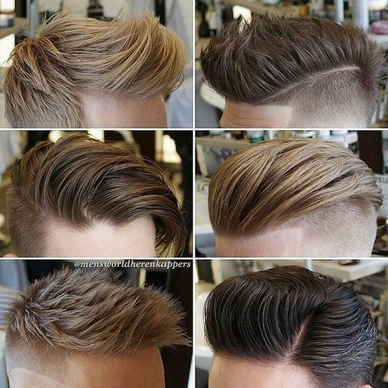

/* ======== Banner ======== */
#banner {
  height: 250px; /* Altura fixa para o banner */
  background-image: url("imagens/ceu_restaurante.png"); /* Imagem de topo */
  background-position: center 25%; /* Centraliza verticalmente com leve deslocamento */
  background-size: cover; /* Preenche sem distorcer */
  background-repeat: no-repeat; /* Evita repetição */
}

/* ======== Seção Sobre ======== */
#sobre {
  max-width: 900px; /* Limita largura para melhor leitura */
  margin: 20px auto; /* Centraliza com espaçamento vertical */
  text-align: center; /* Centraliza texto */
  background: #fff; /* Fundo branco */
  padding: 20px; /* Espaço interno */
  border-radius: 8px; /* Bordas suaves */
  box-shadow: 0 4px 8px rgba(0,0,0,0.08); /* Sombra leve */
}

/* ======== Layout Flex Principal ======== */
.layout-flex {
  display: flex; /* Ativa flexbox */
  flex-wrap: wrap; /* Permite quebra de linha */
  gap: 20px; /* Espaço entre colunas */
  max-width: 1100px; /* Limita largura total */
  margin: 0 auto; /* Centraliza layout */
}

/* ======== Publicidades ======== */
#publicidade {
  flex: 1 1 300px; /* Flexível com base mínima de 300px */
}

.titulo-publicidade {
  text-align: center;
  font-size: 1.3rem;
  color: #ff9800;
  margin-bottom: 14px;
}

.container-publicidade {
  display: flex;
  flex-direction: row;
  gap: 30px;
}

.publicidade {
  background: #fff;
  border-radius: 8px;
  overflow: hidden;
  box-shadow: 0 4px 10px rgba(0,0,0,0.08);
  transition: transform 0.2s ease, box-shadow 0.2s ease;
}

.publicidade:hover {
  transform: translateY(-3px);
  box-shadow: 0 6px 14px rgba(0,0,0,0.12);
}

.publicidade img {
  width: 100%;
  aspect-ratio: 16 / 9;
  object-fit: cover;
  object-position: top center;
}

.mensagem {
  padding: 12px;
  font-size: 0.95rem;
  color: #333;
}

.mensagem h3 {
  margin-top: 8px;
  font-size: 1rem;
}

.destaque {
  background-color: #ff9800;
  color: #fff;
  padding: 2px 6px;
  border-radius: 4px;
}

/* ======== Botões de Ação ======== */
.botao-whatsapp,
.botao-instagram {
  display: inline-block;
  margin-top: 6px;
  padding: 6px 10px;
  font-size: 0.85rem;
  color: #fff;
  text-decoration: none;
  font-weight: bold;
  border-radius: 4px;
  transition: background-color 0.3s ease;
}

.botao-whatsapp { background-color: #25d366; }
.botao-whatsapp:hover { background-color: #1ebe5d; }

.botao-instagram { background-color: #e1306c; }
.botao-instagram:hover { background-color: #c72c61; }

/* ======== Estilo para Vídeos do Instagram ======== */
.buffet-section {
  display: flex; /* Organiza os elementos filhos (texto e vídeo) lado a lado em linha */
  flex-wrap: wrap; /* Permite que os elementos quebrem linha se o espaço horizontal for insuficiente */
  align-items: flex-start; /* Alinha os itens ao topo da seção, mantendo o texto e o vídeo nivelados */
  gap: 15px; /* Espaçamento entre os elementos filhos, tanto horizontal quanto vertical */
  margin-bottom: 20px; /* Espaço abaixo da seção para separar visualmente das próximas */
}
.buffet-section1 iframe{
   display: flex; /* Organiza os elementos filhos (texto e vídeo) lado a lado em linha */
  flex-wrap: wrap; /* Permite que os elementos quebrem linha se o espaço horizontal for insuficiente */
  align-items: flex-start; /* Alinha os itens ao topo da seção, mantendo o texto e o vídeo nivelados */
  gap: 15px; /* Espaçamento entre os elementos filhos, tanto horizontal quanto vertical */
  margin-bottom: 20px; /* Espaço abaixo da seção para separar visualmente das próximas */
}

.buffet-text {
  flex: 1 1 60%; /* Define que o bloco de texto ocupa 60% da largura disponível, com flexibilidade para crescer ou encolher conforme necessário */
}

.buffet-video iframe {
  width: 100%; /* Faz o vídeo ocupar toda a largura do contêiner pai (.buffet-video) */
  height: 500px; /* Define a altura fixa do vídeo — pode ser ajustada conforme o layout desejado */
  border: none; /* Remove qualquer borda ao redor do iframe para um visual mais limpo */
  margin-top: 20px; /* desce o vídeo */
  margin-bottom: -10px; /* sobe o vídeo */
}
.buffet-video1 iframe {
  width: 100%; /* Faz o vídeo ocupar toda a largura do contêiner pai (.buffet-video) */
  height: 500px; /* Define a altura fixa do vídeo — pode ser ajustada conforme o layout desejado */
  border: none; /* Remove qualquer borda ao redor do iframe para um visual mais limpo */
  margin-top: 75px; /* desce o vídeo */
  margin-bottom: -10px; /* sobe o vídeo */
}

/* ======== Faixa Divisória Tempero da Sol ======== */
.faixa-divisoria {
  width: 100%;
  min-height: 180px;
  background-image: url("imagens/fundos_buffet_completo.JPG");
  background-size: cover;
  background-position: center;
  background-repeat: no-repeat;
  margin: 40px 0;
  border-top: 4px solid #ffcc33;
  border-bottom: 4px solid #ffcc33;
}

/* ======== Conteúdo Principal ======== */
#conteudo {
  flex: 2 1 600px;
  background: #fff;
  padding: 30px;
  border-radius: 8px;
  box-shadow: 0 4px 8px rgba(0,0,0,0.08);
}

#conteudo h2 {
  color: #b22222;
  margin-top: 0;
}

/* ======== Rodapé ======== */
footer {
  text-align: center;
  background: #333;
  color: #fff;
  padding: 15px 10px;
  font-size: 0.85rem;
  margin-top: 30px;
}

/* ======== Responsividade ======== */
@media (max-width: 768px) {
  .layout-flex {
    flex-direction: column;
  }

  #publicidade, #conteudo {
    flex: 1 1 100%;
  }

  .publicidade img {
    height: 160px;
  }

  .faixa-divisoria {
    min-height: 120px;
    margin: 30px 0;
    border-width: 3px;
  }

  .video-instagram {
    max-width: 100%;
    padding: 5px;
    border-width: 3px; /* Mantém consistência com faixa no mobile */
  }
}

/* ======== Imagem da Seção Experiência ======== */
.imagem-experiencia {
  width: 100%;
  height: 300px;
  object-fit: cover;
  object-position: 45% 70%;
}

/* ======== Propaganda Final ======== */
.container-publicidade-final {
  display: flex;
  justify-content: center;
  width: 100%;
  margin-top: 20px;
}

#propaganda-final {
  width: 100%;
  max-width: 1100px;
  background-color: #f2f2f2;
}

.publicidade.destaque-final {
  background: #fff;
  border-radius: 8px;
  overflow: hidden;
  box-shadow: 0 4px 10px rgba(0,0,0,0.08);
  transition: transform 0.2s ease, box-shadow 0.2s ease;
}

.publicidade.destaque-final:hover {
  transform: translateY(-3px);
  box-shadow: 0 6px 14px rgba(0,0,0,0.12);
}

.publicidade.destaque-final img {
  width: 100%;
  height: 540px;
  object-fit: contain;
  object-position: center;
}

.publicidade.destaque-final .mensagem {
  padding: 12px;
  font-size: 0.95rem;
  color: #333;
}

.publicidade.destaque-final .mensagem h3 {
  margin-top: 8px;
  font-size: 1rem;
}

@media (max-width: 768px) {
  #propaganda-final {
    flex: 1 1 100%;
  }

  .publicidade.destaque-final img {
    height: 160px;
  }
}

/* ======== Faixa Experiência Tempero ======== */
.experiencia-tempero1 {
  width: 100%;
  height: 380px;
  object-fit: fill;
  object-position: center;
  margin: 40px 0;
  border-top: 4px solid #ffcc33;
  border-bottom: 4px solid #ffcc33;
  box-shadow: 0 4px 8px rgba(0,0,0,0.1);
  display: block;
}

@media (max-width: 768px) {
  .experiencia-tempero1 {
    height: 120px;
    margin: 30px 0;
    border-width: 3px;
  }
}
.centralização-de-h2-buffet h2 {
  font-family: 'Georgia', serif;
  font-size: 2.2em;
  color: #8B4513; /* tom terroso, combina com comida caseira */
  margin-bottom: 20px;
  text-align: center;
}
.centralizacao-h2-linha-divisoria h2 {
  font-family: 'Georgia', serif;
  font-size: 2.2em;
  color: #8B4513; /* tom terroso, combina com comida caseira */
  margin-bottom: 20px;
  text-align: center;
}
.centralizacao-h3-buffet h3 {
  font-family: 'Georgia', serif;
  font-size: 1.5em;
  margin-bottom: 20px;
  text-align: center;
}
.centralizacao_marmitinha h2 {
  font-family: 'Georgia', serif;
  font-size: 2.2em;
  color: #8B4513; /* tom terroso, combina com comida caseira */
  margin-bottom: 20px;
  text-align: center;
}
.centralizacao_marmitinha2 h2 {
  font-family: 'Georgia', serif;
  font-size: 2.2em;
  color: #8B4513; /* tom terroso, combina com comida caseira */
  margin-bottom: 20px;
  text-align: center;
}
.titulo-principal h1 {
  font-family: 'Georgia', serif;
  font-size: 2.5em;
  color: #8B4513; /* tom terroso, combina com comida caseira */
  margin-bottom: 20px;
  text-align: center;
}
.botoes-contato {
  display: flex;
  flex-direction: column; /* Um abaixo do outro */
  align-items: center; /* Centraliza horizontalmente */
  gap: 15px; /* Espaço entre os botões */
  margin-top: 20px;
}

.botoes-contato a {
  display: inline-block;
  background-color: #d35400; /* cor quente que remete à comida */
  color: white;
  text-decoration: none;
  font-weight: bold;
  padding: 15px 30px;
  border-radius: 8px;
  width: 400%; /* quase do tamanho da linha divisória */
  max-width: 600px;
  text-align: center;
  transition: background-color 0.3s ease;
}

.botoes-contato a:hover {
  background-color: #e67e22; /* tom mais claro no hover */
}
.footer {
  text-align: center;
  padding: 20px;
  background-color: #3e3d3d;
  font-size: 14px;
  color: #eceef3;
}

.powered-by {
  display: flex;
  align-items: center;
  justify-content: center;
  gap: 10px;
  margin-top: 10px;
}

.logo-suave {
  height: 24px;
  opacity: 0.6; /* deixa o logo mais suave */
  transition: opacity 0.3s ease;
}

.logo-suave:hover {
  opacity: 1; /* destaca levemente no hover */
}

***
html:

<!DOCTYPE html>
<html lang="pt-BR">
<head>
    <meta charset="UTF-8">
    <meta name="viewport" content="width=device-width, initial-scale=1.0">
    <meta name="description" content="Projeto Tempero da Sol - Sistema de reservas e cálculo de comida por peso com propaganda">
    <title>Tempero da Sol</title>
    <link rel="stylesheet" href="temp_front/temp.styles.css">
</head>
<body>
    
    
 <!-- Início do container-site -->
        <!-- Banner -->
        <header id="banner"></header>

        <main class="layout-flex">

            <!-- 1. SOBRE NÓS -->
            <section id="sobre">
                

                    <h1>Tempero da Sol</h1>
                

                
<strong>O sabor de gerações que você merece!!!</strong>

                

                    Há mais de 30 anos, o <strong>Tempero da Sol</strong> leva à mesa o sabor que nasceu no coração de Minas Gerais. 
                    <strong>Solange</strong>, dona e cozinheira, aprendeu com sua mãe a arte da comida caseira, feita com carinho e atenção em cada detalhe. 
                    Ao seu lado, sua filha — braço direito na cozinha — traz vasta experiência e dedicação, garantindo que cada prato seja um abraço em forma de sabor.
                

                

                    No comando da churrasqueira, <strong>Vandro</strong> atua há mais de 10 anos como churrasqueiro, com um controle impecável sobre o preparo e a estocagem das carnes, seguindo as melhores práticas de higiene. 
                    Seu profissionalismo é o reflexo de um gaúcho apaixonado pela arte do churrasco.
                

                

                    A família se completa com o marido de Solange, que cuida da gestão com zelo e atenção, além de apoiar a esposa em todas as tarefas, inclusive na lavagem e organização dos produtos. 
                    E também com <strong>Alex</strong>, que se doa 100% em todas as situações, trazendo maestria na confecção de gelatinas que encantam os clientes — clientes que são, sem dúvida, nota 10.
                

                

                    No self-service, a churrascaria oferece cortes selecionados como alcatra, picanha, pernil, fraldinha, picanha ao alho, coraçãozinho, linguiça, medalhão de frango, coxa e sobrecoxa, e cupim. 
                    Cada carne é temperada com cuidado especial, realçando o sabor e garantindo maciez. 
                     O carro-chefe é a marmita generosa de aproximadamente <strong>1,2 kg</strong>, perfeita para quem quer levar para casa o sabor irresistível do <strong>Tempero da Sol</strong>.
                

            </section>

            <!-- 2. PUBLICIDADES -->
            

            <aside id="publicidade" aria-label="Seção de anúncios publicitários">
                <section class="secao-publicidade">
                    <h2 class="titulo-publicidade">📢 Publicidades</h2>
                    

                        <!-- ANÚNCIO 1 -->
                        

                            
                            

                                
<strong>Julio - O Natural dos Cortes de Cabelo</strong> 💥

                                <h3>Localização e Contato</h3>
                                

                                    Rua Alfredo Pujol, em frente ao Colégio Barão Homem de Mello 
                                    Santana, São Paulo – SP 
                                    <strong>Instagram:</strong>  
                                    <a href="https://www.instagram.com/hopeup47/" target="_blank" class="botao-instagram">📷 Siga-nos</a> 
                                    <strong>WhatsApp:</strong> 
                                    <a href="https://wa.me/5511953339198" target="_blank" class="botao-whatsapp">📲 Fale conosco</a>
                                

                            

                        

                        <!-- ANÚNCIO 2 -->
                        

                            
                            

                                
<strong>Excelência em reparos automotivos na Zona Norte de SP</strong> 💥

                                <h3>Localização e Contato</h3>
                                

                                    Rua Padre João Gualberto, 440A – Imirim, São Paulo – SP 
                                    <strong>Instagram:</strong>  
                                    <a href="https://instagram.com/_OFICINA3D" target="_blank" class="botao-instagram">📷 Siga-nos</a> 
                                    <strong>WhatsApp:</strong> 
                                    <a href="https://wa.me/5511974026145" target="_blank" class="botao-whatsapp">📲 Fale conosco</a>
                                

                            

                        

                    

                </section>
            </aside>
        

            

    <!-- 3. LINHA DIVISÓRIA -->       
            <section id="experiencia-tempero">
                

                    <h2>Sabores que contam histórias</h2>
                

                
                
                

                

            <!-- 4. EXPERIÊNCIA TEMPERO -->
            

                <h2>Uma Experiência Que Vai Muito Além do Sabor</h2>
            

                <article class="prato-quente">
                    <h3>Arroz à Grega & Feijão da Roça</h3>
                    

                        No coração da cozinha, <strong>Solange</strong> transforma ingredientes simples em 
                        memórias inesquecíveis. O <em>arroz à grega</em>, soltinho e carregado de aromas, 
                        encontra o <em>feijão da roça</em>, encorpado e temperado com aquele toque mineiro 
                        que só quem nasceu no interior conhece. É comida de verdade, feita no fogo da dedicação 
                        e servida com o amor de quem cozinha para a família.
                    

                </article>

                <article class="saladas">
                    <h3>Saladas Frescas & Criativas</h3>
                    

                        Preparadas pela filha de Solange, cada salada é uma obra de arte da natureza: 
                        folhas crocantes, legumes coloridos e combinações que equilibram sabor e nutrição. 
                        Tudo lavado e higienizado com rigor, cortado na hora e temperado para realçar o frescor. 
                        Resultado? Saladas saudáveis, maravilhosas e suculentas, que alimentam o corpo e encantam o olhar.
                    

                </article>

                <article class="churrasqueira">
                    <h3>Picanha no Ponto Perfeito</h3>
                    

                        Na churrasqueira, <strong>Vandro</strong> exibe sua maestria com a <em>picanha</em>: 
                        dourada por fora, suculenta por dentro e servida no espeto profissional que desperta o apetite. 
                        Mais que sabor, a picanha traz benefícios como proteína de alta qualidade e minerais essenciais — 
                        e aqui, cada corte é manuseado com higiene impecável, do preparo ao prato. 
                        Uma experiência que eleva o churrasco à categoria de arte.
                    

                </article>
            </section>
             

            <aside id="propaganda-final" aria-label="Última propaganda">
            <section class="publicidade destaque-final">
                
                

                
<strong>Venha anunciar com a gente e coloque seu negócio em destaque.</strong> 💥

                <h3>Promoções Especiais</h3>
                

                    Anunciamos com a atenção que seu negócio merece! 
                    <strong>Instagram:</strong>  
                    <a href="https://www.instagram.com/hopeup47/" target="_blank" class="botao-instagram">📷 Siga-nos</a> 
                    <strong>WhatsApp:</strong> 
                    <a href="https://wa.me/5511953339198" target="_blank" class="botao-whatsapp">📲 Fale conosco</a>
                

                

            </section>
            </aside>
        

        
        <section id="buffet-completo">
        
        
        

        <h2><strong>Aqui no Tempero da Sol...</strong>
        

        

            <h3>...você Encontra em Nosso Delicioso Buffet...</h3>
        

        
        <!-- Lista de Saladas -->
        

        <section class="buffet-section">
        

            
            <h3>...🥗 Deliciosas e Nutritivas Saladas Comumente Servidas...</h3>
            
            <ul>
            <li>Alface americana, crespa e roxa</li>
            <li>Rúcula e agrião</li>
            <li>Tomate comum e cereja</li>
            <li>Cenoura ralada</li>
            <li>Beterraba crua e cozida</li>
            <li>Repolho branco e roxo</li>
            <li>Milho verde</li>
            <li>Ervilha</li>
            <li>Palmito</li>
            <li>Grão-de-bico</li>
            <li>Ovos de codorna</li>
            <li>Maionese de legumes</li>
            <li>Salpicão</li>
            <li>Molhos variados (rosé, iogurte, limão, mostarda e mel)</li>
            <li><strong>...haverá opções específicas para cada dia da semana...</strong></li>
            </ul>
            <h4>...ao lado, veja este video do nosso buffet de Saladas...SENSACIONAL</h4>
        

        

            <iframe 
            src="https://www.instagram.com/reel/DCoPMouR0s1/embed" 
            width="100%" 
            frameborder="0" 
            scrolling="no" 
            allowtransparency="true" 
            allowfullscreen>
            </iframe>
        

        </section>

        <!-- Seção 2: Pratos Quentes Comuns -->
        <section class="buffet-section">
        

            <h3>🍛... Em Nosso Buffet de Pratos Quentes há...</h3>
            
            <ul>
            <li>Arroz branco, integral e Carreteiro</li>
            <li>Feijão carioca e preto</li>
            <li>Farofa tradicional</li>
            <li>Macarrão ao alho e óleo</li>
            <li>Lasanha de carne ou frango</li>
            <li>Purê de batata</li>
            <li>Escondidinho de carne seca</li>
            <li>Legumes refogados</li>
            <li>Frango com quiabo</li>
            <li>Moqueca de peixe</li>
            <li>Estrogonofe</li>
            <li><strong>...haverá opções específicas para cada dia da semana...</strong></li>
            </ul>
            <h4>...ao lado, veja o video das maravilhas do buffet de pratos quentes...FABULOSO</h4>
        

        

            <iframe 
            src="https://www.instagram.com/reel/DCCUeqRPeHH/embed" 
            width="100%" 
            height="400" 
            frameborder="0" 
            scrolling="no" 
            allowtransparency="true" 
            allowfullscreen>
            </iframe>
        

        </section>

        <!-- Seção 3: Churrasco -->
        <section class="buffet-section">
        

            <h3>...🥩 Carnes Nobres e Paladares Únicos...</h3>
            
            <ul>
            <li>Picanha</li>
            <li>Alcatra</li>
            <li>Fraldinha</li>
            <li>Costela bovina</li>
            <li>Linguiça toscana e calabresa</li>
            <li>Coração de frango</li>
            <li>Medalhão de frango com bacon</li>
            <li>Coxa e sobrecoxa</li>
            <li>Carne de porco (pernil, costelinha)</li>
            <li>Peixe grelhado</li>
            <li>Espetinhos variados</li>
            <li><strong>...haverá opções específicas para cada dia da semana...</strong></li>
            </ul>
            <h4>...ao lado, video de Picanha de qualidade, com aquela gordurinha FANTÁSTICA...</h4>
        

        

            <iframe 
            src="https://www.instagram.com/reel/C_3Jm9wg2QZ/embed" 
            width="100%" 
            height="400" 
            frameborder="0" 
            scrolling="no" 
            allowtransparency="true" 
            allowfullscreen>
            </iframe>
        

        </section>

            <!-- *** -->

        
 <!-- Fim do buffet-flex -->

        <section>
        

            <h2>🔥 Do prato montado à marmita completa</h2>
        

        
Seja no buffet com churrasco ou na marmita para viagem, o <strong>Tempero da Sol</strong> entrega sempre o mesmo compromisso: comida farta, sabor marcante e preço justo.

        
Depois de se deliciar com nosso buffet por quilo ou aproveitar o self-service com churrasco, que tal levar um pouco desse sabor pra casa?

        
Nossas marmitas são preparadas com os mesmos cortes nobres e acompanhamentos generosos — tudo com aquele tempero caseiro que conquista no primeiro garfo.

        

        <section id="experiencia-tempero">
                

                    <h2>👩‍🍳 Um recado da Sol pra você</h2>                    
                

                <h3>Do prato montado à marmita completa</h3>
                
        </section>
            
            
<strong>Oi, sou a Sol — e é com muito carinho que preparo cada receita que sai da nossa cozinha. Aqui no Tempero da Sol, não tem segredo: é comida feita com alma, como se fosse pra minha própria família.

            
Se você já passou por aqui e montou seu prato no buffet, sabe do que estou falando. E se ainda não experimentou nossas marmitas, deixa eu te contar: elas são pensadas pra matar a fome de verdade, sem miséria e com muito sabor.

            
Não é só arroz e feijão — é aquele frango bem temperado, a linguiça crocante, a panceta que derrete na boca, e a picanha que faz qualquer dia parecer domingo. Tudo isso acompanhado de batata frita, farofa e macarrão, porque aqui a gente acredita que comida boa tem que ser completa.

            
Então se hoje você não pode sentar na nossa mesa, leva um pedacinho dela com você. As marmitas estão sempre quentinhas, esperando por você com o mesmo cuidado que eu colocaria num prato pra minha família.</strong>

        

        <section>
            

                    <h2>🔥 Marmitas para Retirar</h2>
                

            
            
Leve o sabor do Tempero da Sol para casa com nossas marmitas fartas e irresistíveis. Todas acompanham:

            <ul>
            <li>Arroz</li>
            <li>Feijão</li>
            <li>Farofa</li>
            <li>Batata frita</li>
            <li>Macarrão</li>
            </ul>
            
<strong>Peso mínimo garantido:</strong> 1,2 kg de refeição!

            <h3>⭐🍖Opções e Preços:</h3>
            <ul>
            <li><strong>Marmita mista</strong> (picanha, alcatra, pernil, cupim, panceta, linguiça, frango): R$ 30,00</li>
            <li><strong>Pernil acebolado:</strong> R$ 20,00</li>
            <li><strong>Calabresa acebolada:</strong> R$ 20,00</li>
            <li><strong>Frango e linguiça</strong> (2 frangos e 1 linguiça ou vice-versa): R$ 20,00</li>
            <li><strong>Filé de frango</strong> (3 a 4 filés): R$ 20,00</li>
            <li><strong>Frango à milanesa</strong> (3 a 4 filés): R$ 20,00</li>
            </ul>

            
<em>Preços sujeitos a alteração sem aviso prévio.</em>

            <section class="contato-tempero">
            <h2>❤️🍲 Peça com carinho, receba com sabor</h2>
            

                <strong>Fale direto com a Sol pelo WhatsApp, escolha sua marmita de preferência, pague via Pix e retire no local.</strong>
                Simples, rápido e feito com afeto — como tudo que sai da nossa cozinha.
            

            

                <a href="https://wa.me/5511958040466" target="_blank" class="botao-whatsapp">
                📲 Pedir pelo WhatsApp
                </a>
                <a href="https://www.instagram.com/temperodasol/" target="_blank" class="botao-instagram">
                📷 Ver no Instagram
                </a>
            

            </section>

            
Endereço: <strong>Rua Alfredo Pujol, 106 — Santana, Zona Norte de São Paulo</strong>

            
Telefone fixo: <strong>(11) 2367-8733</strong>

        </section>
        </section>
        
        </main>
       

    
 <!-- Fim do container-site -->

    <!-- Rodapé -->
    <footer class="footer">
    
© 2025 Tempero da Sol - Todos os direitos reservados

    

        
        © Equipe Powered By HopeUp 7.DEV
    

    </footer>

</body>
</html>

***
css:

/* ======== Banner ======== */
#banner {
  height: 250px; /* Altura fixa para o banner */
  background-image: url("imagens/ceu_restaurante.png"); /* Imagem de topo */
  background-position: center 25%; /* Centraliza verticalmente com leve deslocamento */
  background-size: cover; /* Preenche sem distorcer */
  background-repeat: no-repeat; /* Evita repetição */
}

/* ======== Seção Sobre ======== */
#sobre {
  max-width: 900px; /* Limita largura para melhor leitura */
  margin: 20px auto; /* Centraliza com espaçamento vertical */
  text-align: center; /* Centraliza texto */
  background: #fff; /* Fundo branco */
  padding: 20px; /* Espaço interno */
  border-radius: 8px; /* Bordas suaves */
  box-shadow: 0 4px 8px rgba(0,0,0,0.08); /* Sombra leve */
}

/* ======== Layout Flex Principal ======== */
.layout-flex {
  display: flex; /* Ativa flexbox */
  flex-wrap: wrap; /* Permite quebra de linha */
  gap: 20px; /* Espaço entre colunas */
  max-width: 1100px; /* Limita largura total */
  margin: 0 auto; /* Centraliza layout */
}

/* ======== Publicidades ======== */
#publicidade {
  flex: 1 1 300px; /* Flexível com base mínima de 300px */
}

.titulo-publicidade {
  text-align: center;
  font-size: 1.3rem;
  color: #ff9800;
  margin-bottom: 14px;
}

.container-publicidade {
  display: flex;
  flex-direction: row;
  gap: 30px;
}

.publicidade {
  background: #fff;
  border-radius: 8px;
  overflow: hidden;
  box-shadow: 0 4px 10px rgba(0,0,0,0.08);
  transition: transform 0.2s ease, box-shadow 0.2s ease;
}

.publicidade:hover {
  transform: translateY(-3px);
  box-shadow: 0 6px 14px rgba(0,0,0,0.12);
}

.publicidade img {
  width: 100%;
  aspect-ratio: 16 / 9;
  object-fit: cover;
  object-position: top center;
}

.mensagem {
  padding: 12px;
  font-size: 0.95rem;
  color: #333;
}

.mensagem h3 {
  margin-top: 8px;
  font-size: 1rem;
}

.destaque {
  background-color: #ff9800;
  color: #fff;
  padding: 2px 6px;
  border-radius: 4px;
}

/* ======== Botões de Ação ======== */
.botao-whatsapp,
.botao-instagram {
  display: inline-block;
  margin-top: 6px;
  padding: 6px 10px;
  font-size: 0.85rem;
  color: #fff;
  text-decoration: none;
  font-weight: bold;
  border-radius: 4px;
  transition: background-color 0.3s ease;
}

.botao-whatsapp { background-color: #25d366; }
.botao-whatsapp:hover { background-color: #1ebe5d; }

.botao-instagram { background-color: #e1306c; }
.botao-instagram:hover { background-color: #c72c61; }

/* ======== Estilo para Vídeos do Instagram ======== */
.buffet-section {
  display: flex; /* Organiza os elementos filhos (texto e vídeo) lado a lado em linha */
  flex-wrap: wrap; /* Permite que os elementos quebrem linha se o espaço horizontal for insuficiente */
  align-items: flex-start; /* Alinha os itens ao topo da seção, mantendo o texto e o vídeo nivelados */
  gap: 15px; /* Espaçamento entre os elementos filhos, tanto horizontal quanto vertical */
  margin-bottom: 20px; /* Espaço abaixo da seção para separar visualmente das próximas */
}
.buffet-section1 iframe{
   display: flex; /* Organiza os elementos filhos (texto e vídeo) lado a lado em linha */
  flex-wrap: wrap; /* Permite que os elementos quebrem linha se o espaço horizontal for insuficiente */
  align-items: flex-start; /* Alinha os itens ao topo da seção, mantendo o texto e o vídeo nivelados */
  gap: 15px; /* Espaçamento entre os elementos filhos, tanto horizontal quanto vertical */
  margin-bottom: 20px; /* Espaço abaixo da seção para separar visualmente das próximas */
}

.buffet-text {
  flex: 1 1 60%; /* Define que o bloco de texto ocupa 60% da largura disponível, com flexibilidade para crescer ou encolher conforme necessário */
}

.buffet-video iframe {
  width: 100%; /* Faz o vídeo ocupar toda a largura do contêiner pai (.buffet-video) */
  height: 500px; /* Define a altura fixa do vídeo — pode ser ajustada conforme o layout desejado */
  border: none; /* Remove qualquer borda ao redor do iframe para um visual mais limpo */
  margin-top: 20px; /* desce o vídeo */
  margin-bottom: -10px; /* sobe o vídeo */
}
.buffet-video1 iframe {
  width: 100%; /* Faz o vídeo ocupar toda a largura do contêiner pai (.buffet-video) */
  height: 500px; /* Define a altura fixa do vídeo — pode ser ajustada conforme o layout desejado */
  border: none; /* Remove qualquer borda ao redor do iframe para um visual mais limpo */
  margin-top: 75px; /* desce o vídeo */
  margin-bottom: -10px; /* sobe o vídeo */
}

/* ======== Faixa Divisória Tempero da Sol ======== */
.faixa-divisoria {
  width: 100%;
  min-height: 180px;
  background-image: url("imagens/fundos_buffet_completo.JPG");
  background-size: cover;
  background-position: center;
  background-repeat: no-repeat;
  margin: 40px 0;
  border-top: 4px solid #ffcc33;
  border-bottom: 4px solid #ffcc33;
}

/* ======== Conteúdo Principal ======== */
#conteudo {
  flex: 2 1 600px;
  background: #fff;
  padding: 30px;
  border-radius: 8px;
  box-shadow: 0 4px 8px rgba(0,0,0,0.08);
}

#conteudo h2 {
  color: #b22222;
  margin-top: 0;
}

/* ======== Rodapé ======== */
footer {
  text-align: center;
  background: #333;
  color: #fff;
  padding: 15px 10px;
  font-size: 0.85rem;
  margin-top: 30px;
}

/* ======== Responsividade ======== */
@media (max-width: 768px) {
  .layout-flex {
    flex-direction: column;
  }

  #publicidade, #conteudo {
    flex: 1 1 100%;
  }

  .publicidade img {
    height: 160px;
  }

  .faixa-divisoria {
    min-height: 120px;
    margin: 30px 0;
    border-width: 3px;
  }

  .video-instagram {
    max-width: 100%;
    padding: 5px;
    border-width: 3px; /* Mantém consistência com faixa no mobile */
  }
}

/* ======== Imagem da Seção Experiência ======== */
.imagem-experiencia {
  width: 100%;
  height: 300px;
  object-fit: cover;
  object-position: 45% 70%;
}

/* ======== Propaganda Final ======== */
.container-publicidade-final {
  display: flex;
  justify-content: center;
  width: 100%;
  margin-top: 20px;
}

#propaganda-final {
  width: 100%;
  max-width: 1100px;
  background-color: #f2f2f2;
}

.publicidade.destaque-final {
  background: #fff;
  border-radius: 8px;
  overflow: hidden;
  box-shadow: 0 4px 10px rgba(0,0,0,0.08);
  transition: transform 0.2s ease, box-shadow 0.2s ease;
}

.publicidade.destaque-final:hover {
  transform: translateY(-3px);
  box-shadow: 0 6px 14px rgba(0,0,0,0.12);
}

.publicidade.destaque-final img {
  width: 100%;
  height: 540px;
  object-fit: contain;
  object-position: center;
}

.publicidade.destaque-final .mensagem {
  padding: 12px;
  font-size: 0.95rem;
  color: #333;
}

.publicidade.destaque-final .mensagem h3 {
  margin-top: 8px;
  font-size: 1rem;
}

@media (max-width: 768px) {
  #propaganda-final {
    flex: 1 1 100%;
  }

  .publicidade.destaque-final img {
    height: 160px;
  }
}

/* ======== Faixa Experiência Tempero ======== */
.experiencia-tempero1 {
  width: 100%;
  height: 380px;
  object-fit: fill;
  object-position: center;
  margin: 40px 0;
  border-top: 4px solid #ffcc33;
  border-bottom: 4px solid #ffcc33;
  box-shadow: 0 4px 8px rgba(0,0,0,0.1);
  display: block;
}

@media (max-width: 768px) {
  .experiencia-tempero1 {
    height: 120px;
    margin: 30px 0;
    border-width: 3px;
  }
}
.centralização-de-h2-buffet h2 {
  font-family: 'Georgia', serif;
  font-size: 2.2em;
  color: #8B4513; /* tom terroso, combina com comida caseira */
  margin-bottom: 20px;
  text-align: center;
}
.centralizacao-h2-linha-divisoria h2 {
  font-family: 'Georgia', serif;
  font-size: 2.2em;
  color: #8B4513; /* tom terroso, combina com comida caseira */
  margin-bottom: 20px;
  text-align: center;
}
.centralizacao-h3-buffet h3 {
  font-family: 'Georgia', serif;
  font-size: 1.5em;
  margin-bottom: 20px;
  text-align: center;
}
.centralizacao_marmitinha h2 {
  font-family: 'Georgia', serif;
  font-size: 2.2em;
  color: #8B4513; /* tom terroso, combina com comida caseira */
  margin-bottom: 20px;
  text-align: center;
}
.centralizacao_marmitinha2 h2 {
  font-family: 'Georgia', serif;
  font-size: 2.2em;
  color: #8B4513; /* tom terroso, combina com comida caseira */
  margin-bottom: 20px;
  text-align: center;
}
.titulo-principal h1 {
  font-family: 'Georgia', serif;
  font-size: 2.5em;
  color: #8B4513; /* tom terroso, combina com comida caseira */
  margin-bottom: 20px;
  text-align: center;
}
.botoes-contato {
  display: flex;
  flex-direction: column; /* Um abaixo do outro */
  align-items: center; /* Centraliza horizontalmente */
  gap: 15px; /* Espaço entre os botões */
  margin-top: 20px;
}

.botoes-contato a {
  display: inline-block;
  background-color: #d35400; /* cor quente que remete à comida */
  color: white;
  text-decoration: none;
  font-weight: bold;
  padding: 15px 30px;
  border-radius: 8px;
  width: 400%; /* quase do tamanho da linha divisória */
  max-width: 600px;
  text-align: center;
  transition: background-color 0.3s ease;
}

.botoes-contato a:hover {
  background-color: #e67e22; /* tom mais claro no hover */
}
.footer {
  text-align: center;
  padding: 20px;
  background-color: #3e3d3d;
  font-size: 14px;
  color: #eceef3;
}

.powered-by {
  display: flex;
  align-items: center;
  justify-content: center;
  gap: 10px;
  margin-top: 10px;
}

.logo-suave {
  height: 24px;
  opacity: 0.6; /* deixa o logo mais suave */
  transition: opacity 0.3s ease;
}

.logo-suave:hover {
  opacity: 1; /* destaca levemente no hover */
}

