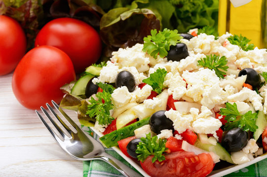

<!DOCTYPE html>
<!-- Define o documento como HTML5 -->

<html lang="pt-BR">
<!-- Elemento raiz da página, com idioma definido como Português do Brasil -->

<head>
  <!-- Cabeçalho com metadados e links de estilo -->

  <meta charset="UTF-8">
  <!-- Define codificação de caracteres como UTF-8 para suportar acentuação -->

  <meta name="viewport" content="width=device-width, initial-scale=1.0">
  <!-- Ajusta a viewport para dispositivos móveis, garantindo responsividade -->

  <meta name="description"
        content="Projeto Tempero da Sol - Sistema de reservas e cálculo de comida por peso com propaganda">
  <!-- Descrição do site para mecanismos de busca e compartilhamento -->

  <title>Tempero da Sol</title>
  <!-- Título exibido na aba do navegador -->

  <link rel="stylesheet" href="temp.styles.css">
  <!-- Importa o arquivo CSS externo com estilos da página -->
</head>

<body>
  <!-- Corpo da página: todo o conteúdo visível ao visitante -->

  

    <!-- Contêiner principal que agrupa todo o layout do site -->

    <header id="banner"></header>
    <!-- Seção de banner no topo; imagem e estilo aplicados via CSS -->

    <main class="layout-flex">
      <!-- Área principal com layout flexível para organizar seções lado a lado -->

      <section id="sobre">
        <!-- Seção “Sobre nós” com apresentação da história e missão -->

        

          <!-- Bloco para títulos principais dentro da seção Sobre -->

          <h1>Tempero da Sol</h1>
          <!-- Título principal do site -->

          <h2>O sabor de gerações que você merece!</h2>
          <!-- Slogan ou subtítulo que complementa o título principal -->
        

        

          <strong>Sol</strong> começou a cozinhar aos 7 anos e, desde então,
          carrega uma bagagem que vai muito além das receitas.
        

        <!-- Parágrafo introdutório sobre a fundadora Sol -->

        

          Há mais de <strong>30 anos</strong>, o <strong>Tempero da Sol</strong>
          leva à mesa o sabor que nasceu no coração de Minas Gerais.
        

        <!-- Parágrafo com destaque de tempo de tradição e origem geográfica -->

        

          No comando da churrasqueira, <strong>Vandro</strong> atua há mais de
          <strong>10 anos</strong> como churrasqueiro.
        

        <!-- Parágrafo sobre o churrasqueiro da equipe -->

        

          A família se completa com o marido de <strong>Sol</strong>, que cuida
          da gestão, e com <strong>Alex</strong>, responsável pelas gelatinas.
        

        <!-- Parágrafo apresentando outros membros da equipe -->

        

          No self-service, oferecemos cortes selecionados como
          <strong>picanha</strong>, <strong>alcatra</strong>, <strong>cupim</strong>,
          entre outros.
        

        <!-- Parágrafo listando alguns produtos do buffet -->
      </section>

      

        <!-- Wrapper para a área de anúncios/publicidades -->

        <aside id="publicidade" aria-label="Seção de anúncios publicitários">
          <!-- Coluna lateral de publicidade com identificação semântica -->

          <section class="secao-publicidade">
            <!-- Bloco de publicidades, contendo título e cards de anúncio -->

            <h2 class="titulo-publicidade">📢 Publicidades</h2>
            <!-- Título da seção de anúncios -->

            

              <!-- Container flex para alinhar cards de publicidade -->

              

                <!-- Card de publicidade específico, com classe para estilo de corte -->

                
                <!-- Imagem do anúncio com texto alternativo para acessibilidade -->

                

                  <!-- Texto e links de contato dentro do anúncio -->

                  
<strong>Junior - O Natural dos Cortes de Cabelo</strong> 💥

                  <!-- Cabeçalho em negrito para o nome do serviço -->

                  <h3>Localização e Contato</h3>
                  <!-- Subtítulo com destaque sobre localização e contato -->

                  

                    Rua Alfredo Pujol, em frente ao Colégio Barão Homem de Mello 
                    Santana, São Paulo – SP 
                    <strong>Instagram:</strong>
                    <a href="https://www.instagram.com/saravaleriohair/" target="_blank"
                       class="botao-instagram">📷 Siga-nos</a> 
                    <strong>WhatsApp:</strong>
                    <a href="https://wa.me/5511988243521" target="_blank"
                       class="botao-whatsapp">📲 Junior</a>
                  

                  <!-- Parágrafo com endereço, Instagram e WhatsApp -->
                

              

              

                <!-- Segundo card de publicidade para funilaria -->

                
                <!-- Imagem ilustrativa do serviço de funilaria -->

                

                  <!-- Texto e links para entrada em contato -->

                  
<strong>Excelência em reparos automotivos na Zona Norte de SP</strong> 💥

                  <h3>Localização e Contato</h3>

                  

                    Rua Padre João Gualberto, 440A – Imirim, São Paulo – SP 
                    <strong>Instagram:</strong>
                    <a href="https://instagram.com/_OFICINA3D" target="_blank"
                       class="botao-instagram">📷 Siga-nos</a> 
                    <strong>WhatsApp:</strong>
                    <a href="https://wa.me/5511974026145" target="_blank"
                       class="botao-whatsapp">📲 Fale conosco</a>
                  

                  <!-- Detalhes e contatos de oficina de funilaria -->
                

              

            

          </section>
        </aside>
      

      <section id="experiencia-tempero">
        <!-- Seção destacando experiência e buffet temático -->

        

          <!-- Container para centralizar o título da seção -->

          <h2>Sabores que contam histórias</h2>
          <!-- Título principal da seção Experiência Tempero -->
        

        
        <!-- Imagem ilustrativa do buffet completo -->

        

          <!-- Bloco visual de separação com título -->

          <h2>Uma Experiência Que Vai Muito Além do Sabor</h2>
        

        <article class="prato-quente">
          <!-- Artigo sobre prato quente típico -->

          <h3>Arroz à Grega & Feijão da Roça</h3>
          <!-- Subtítulo do artigo -->

          

            No coração da cozinha, <strong>Sol</strong> transforma ingredientes simples
            em memórias inesquecíveis.
          

          <!-- Parágrafo descritivo do prato quente -->
        </article>

        <article class="saladas">
          <!-- Artigo sobre saladas frescas -->

          <h3>Saladas Frescas & Criativas</h3>
          <!-- Subtítulo sobre saladas -->

          

            Preparadas pela filha de Sol, cada salada é uma obra de arte da natureza.
          

          <!-- Parágrafo explicando a preparação das saladas -->
        </article>

        <article class="churrasqueira">
          <!-- Artigo sobre churrasco e cortes nobres -->

          <h3>Picanha no Ponto Perfeito</h3>
          <!-- Subtítulo do churrasco -->

          

            Na churrasqueira, <strong>Vandro</strong> exibe sua maestria com a <em>picanha</em>.
          

          <!-- Parágrafo destacando a qualidade da picanha -->
        </article>
      </section>

      

        <!-- Container para a última propaganda em destaque -->

        <aside id="propaganda-final" aria-label="Última propaganda">
          <!-- Bloco de propaganda final com chamada para anúncio -->

          <section class="publicidade destaque-final">
            <!-- Card de publicidade maior, classe “destaque-final” -->

            
            <!-- Imagem chamativa convidando empresários a anunciar -->

            

              <!-- Texto e botões de interação -->

              
<strong>Venha anunciar com a gente e coloque seu negócio em destaque.</strong>

              <h3>Promoções Especiais</h3>

              

                Instagram:
                <a href="https://www.instagram.com/hopeup47/" target="_blank"
                   class="botao-instagram">📷 Siga-nos</a> 
                WhatsApp:
                <a href="https://wa.me/5511953339198" target="_blank"
                   class="botao-whatsapp">📲 Fale conosco</a>
              

            

          </section>
        </aside>
      

      <section id="buffet-completo">
        <!-- Seção detalhando opções do buffet completo -->

        

          <h2><strong>Aqui no Tempero da Sol...</strong></h2>
        

        <!-- Título introdutório do buffet -->

        

          <h3>...você Encontra em Nosso Delicioso Buffet...</h3>
        

        <!-- Subtítulo complementando o buffet -->

        

          <!-- Container flexível para listar categorias do buffet -->

          <section class="buffet-section">
            

              <h3>...🥗 Deliciosas e Nutritivas Saladas Comumente Servidas...</h3>
              <!-- Lista de saladas oferecidas -->
              <ul>
                <li>Alface Americana, Crespa e Roxa</li>
                <li>Rúcula e Agrião</li>
                <li>Tomate Comum e Cereja</li>
                <!-- Outros itens omitidos para brevidade -->
              </ul>
              <h4>Saladas que são nutritivas e muito gostosaaas...Vem!!!</h4>
            

            

              
              <!-- Imagem do buffet de saladas -->
              <a href="https://www.instagram.com/temperodasol/" target="_blank"
                 class="botao-instagram">📷 Ver no Instagram</a>
            

          </section>

          <!-- As demais subseções de pratos quentes e carnes seguem o mesmo padrão de markup -->
        

      </section>

      <section>
        <!-- Seção final sobre marmitas para viagem -->

        

          <h2>🔥 Do prato montado à marmita completa</h2>
        

        <!-- Título da seção de marmitas -->

        

          As marmitas são preparadas com os mesmos cortes nobres e acompanhamentos
          generosos — tudo com aquele tempero caseiro.
        

        <!-- Descrição geral das marmitas -->

        <section class="contato-tempero">
          <!-- Bloco de contato para pedidos via WhatsApp -->

          <h2>❤️🍲 Peça com carinho, receba com sabor</h2>
          

            <strong>Fale direto com a Sol pelo WhatsApp, escolha sua marmita,
            pague via Pix e retire no local.</strong>
          

          <!-- Orientações para pedido -->

          

            <!-- Botões para contato -->
            <a href="https://wa.me/5511958040466" target="_blank"
               class="botao-whatsapp">📲 Pedir pelo WhatsApp</a>
            <a href="https://www.instagram.com/temperodasol/" target="_blank"
               class="botao-instagram">📷 Ver no Instagram</a>
          

        </section>

        
Endereço: <strong>Rua Alfredo Pujol, 106 — Santana, SP</strong>

        <!-- Endereço de retirada -->
        
Telefone fixo: <strong>(11) 2367-8733</strong>

        <!-- Telefone para contato fixo -->
      </section>
    </main>
  

  <footer class="footer">
    <!-- Rodapé com direitos autorais e badge “Powered By” -->

    
© 2025 Tempero da Sol - Todos os direitos reservados

    

      
      © Equipe Powered By HopeUp 7.DEV
    

  </footer>
</body>
</html>
